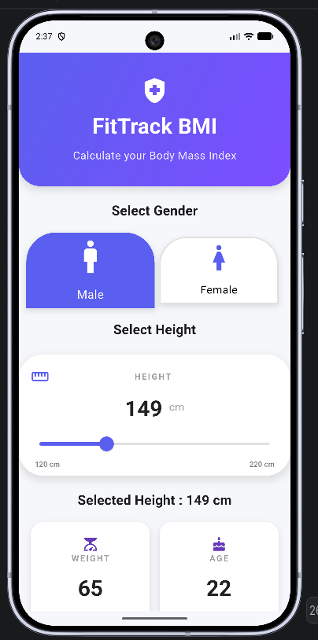
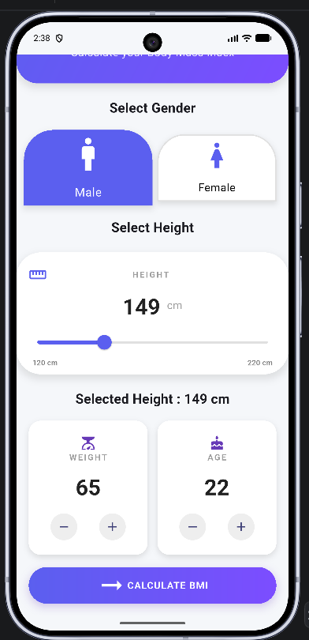
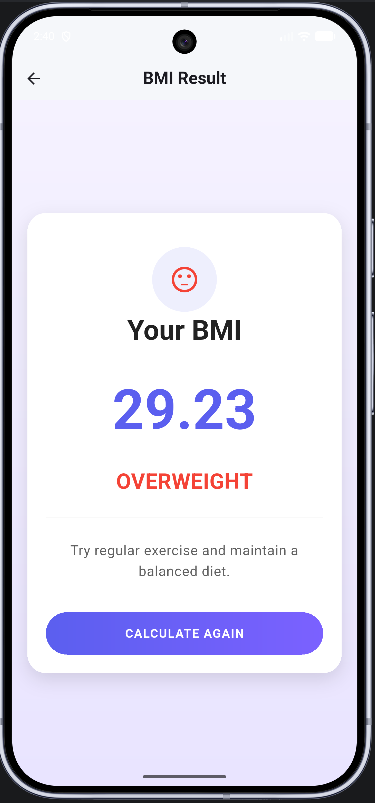
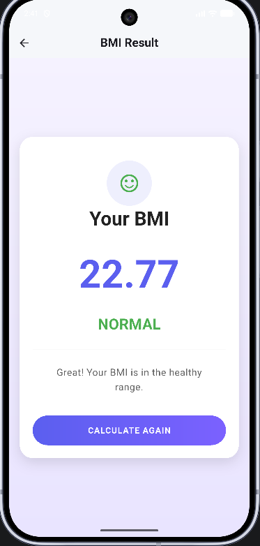
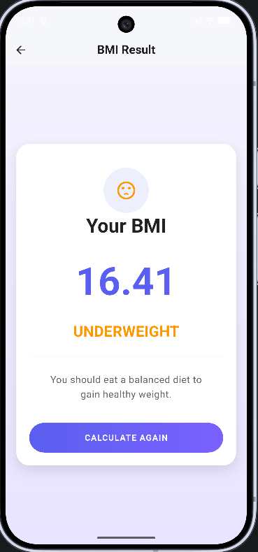

# 💜 FitTrack BMI

<p align="center">
  <h3 align="center">A Modern Flutter BMI Calculator</h3>

  <p align="center">
    Calculate your Body Mass Index with a beautiful and responsive Flutter UI.
  </p>


---

## ✨ Overview

FitTrack BMI is a modern Flutter application designed to calculate Body Mass Index (BMI) quickly and accurately.

The application features a clean user interface, responsive design, smooth animations, and reusable Flutter widgets.

This project was built as part of my Flutter learning journey while focusing on writing clean, maintainable code.

---

## 📱 Screenshots

### 🏠 Home Screen

<p align="center">
  
  
</p>

### 📊 Result Screen

<p align="center">
    
  
  
</p>

---

## 🚀 Features

- 🎯 Accurate BMI Calculation
- 👨 Male & Female Selection
- 📏 Adjustable Height Slider
- ⚖ Weight Counter
- 🎂 Age Counter
- 📊 Personalized BMI Result
- 💬 Health Recommendation
- 🎨 Modern Material 3 UI
- 📱 Responsive Layout
- ✨ Smooth Animations
- ♻ Reusable Widgets
- 🌈 Gradient Design

---

## 📐 BMI Formula

BMI is calculated using:

```
BMI = Weight (kg)
/ Height² (m²)
```

Example

```
Weight = 70 kg

Height = 1.75 m

BMI = 70 / (1.75 × 1.75)

BMI = 22.86
```

---

## 🛠 Tech Stack

- Flutter
- Dart
- Material 3
- VS Code
- Android Studio
- Git
- GitHub

---

## 📂 Project Structure

```text
lib/
│
├── screens/
│   ├── home_screen.dart
│   └── result_screen.dart
│
├── widgets/
│   ├── header_widget.dart
│   ├── gender_card.dart
│   ├── height.dart
│   ├── value_card.dart
│   └── calculate_button.dart
│
├── theme/
│   └── app_theme.dart
│
├── utils/
│   ├── colors.dart
│   └── bmi_calculator.dart
│
└── main.dart
```

---

## ⚙ Installation

Clone the repository

```bash
git clone https://github.com/prem70198/flutter-BMI-calculator.git
```

Move into the project

```bash
cd flutter-BMI-calculator
```

Install dependencies

```bash
flutter pub get
```

Run the application

```bash
flutter run
```

---

## 🎯 BMI Categories

| BMI | Category |
|------|----------|
| <18.5 | Underweight |
| 18.5 - 24.9 | Normal |
| 25 - 29.9 | Overweight |
| ≥30 | Obese |

---

## 📌 Future Improvements

- 🌙 Dark Mode
- 📜 BMI History
- 📊 Charts
- ☁ Cloud Sync
- 👤 User Profile
- 🔔 Notifications
- 🌍 Multiple Languages
- 🍎 Apple Health Integration
- ❤️ Google Fit Integration

---

## 🤝 Contributing

Contributions are welcome.

If you'd like to improve this project, feel free to fork the repository and submit a pull request.

---

## 👨‍💻 Author

**Prince Kumar**

B.Tech CSE Student

Flutter Developer

GitHub:
https://github.com/prem70198

LinkedIn:
https://linkedin.com/in/prince-kumar-2318ab336

---

## ⭐ Support

If you like this project,

please consider giving it a ⭐ on GitHub.

It motivates me to build more awesome Flutter applications.

---

Made with ❤️ using Flutter